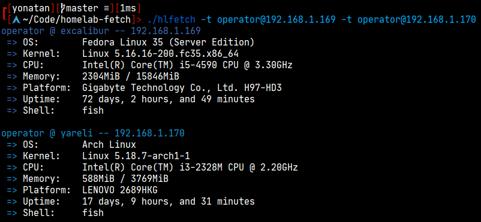

# Homelab Fetch
A fetch tool that uses SSH to display information about servers in your homelab



# Note
This script is in very early stages of development. It probably has bugs, and won't necessarily work with your particular machines. Issues and pull requests are always welcome.

# Usage

```
$ hlfetch --help
usage: hlfetch [-h] -t TARGET

A fetch tool that uses SSH to display information about servers in your homelab

options:
  -h, --help            show this help message and exit
  -t TARGET, --target TARGET
                        A target to fetch (username@host)
```